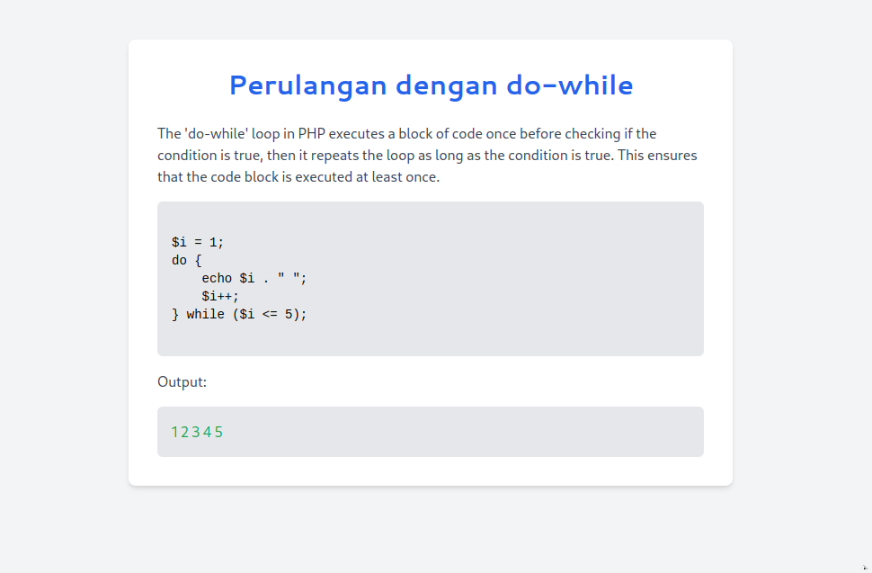

# Laravel Project: Loop Examples

This project demonstrates the usage of different types of loops in Laravel.

## Installation Guide

Follow these steps to install Laravel and create a "Hello World" page:

1. Install Composer: Download and install Composer from https://getcomposer.org/

2. Install Laravel:
   ```
   composer create-project laravel/laravel my-laravel-app
   ```

3. Navigate to the project directory:
   ```
   cd my-laravel-app
   ```

4. Start the development server:
   ```
   php artisan serve
   ```

5. Open your browser and go to `http://localhost:8000`. You should see the Laravel welcome page.

6. To create a "Hello World" page:
   - Open `routes/web.php`
   - Add the following route:
     ```php
     Route::get('/hello', function () {
         return 'Hello World';
     });
     ```
   - Visit `http://localhost:8000/hello` in your browser to see the "Hello World" message.

## Loop Examples

This project includes examples of different types of loops in Laravel:

### For Loop

File: `resources/views/loops/for.blade.php`

This example demonstrates a basic for loop that iterates 5 times, displaying the current iteration number.

### While Loop

File: `resources/views/loops/while.blade.php`

This example shows a while loop that continues until a condition is met. It simulates a dice roll until a 6 is rolled.

### Do-While Loop

File: `resources/views/loops/do-while.blade.php`

This example illustrates a do-while loop, which is similar to the while loop but guarantees at least one execution. It also simulates a dice roll until a 6 is rolled.

### Foreach Loop

File: `resources/views/loops/foreach.blade.php`

This example showcases a foreach loop, which is used to iterate over arrays or collections. It displays a list of fruits from an array.

## How to Run the Examples

1. Start the Laravel development server:
   ```
   php artisan serve
   ```

2. Visit the following URLs in your browser:
   - For Loop: `http://localhost:8000/for`
   - While Loop: `http://localhost:8000/while`
   - Do-While Loop: `http://localhost:8000/do-while`
   - Foreach Loop: `http://localhost:8000/foreach`

Each page will demonstrate the respective loop in action.

## Screenshots

Here are some screenshots of the loop examples in action:

### Homepage


### For Loop


### While Loop


### Do-While Loop


### Foreach Loop

